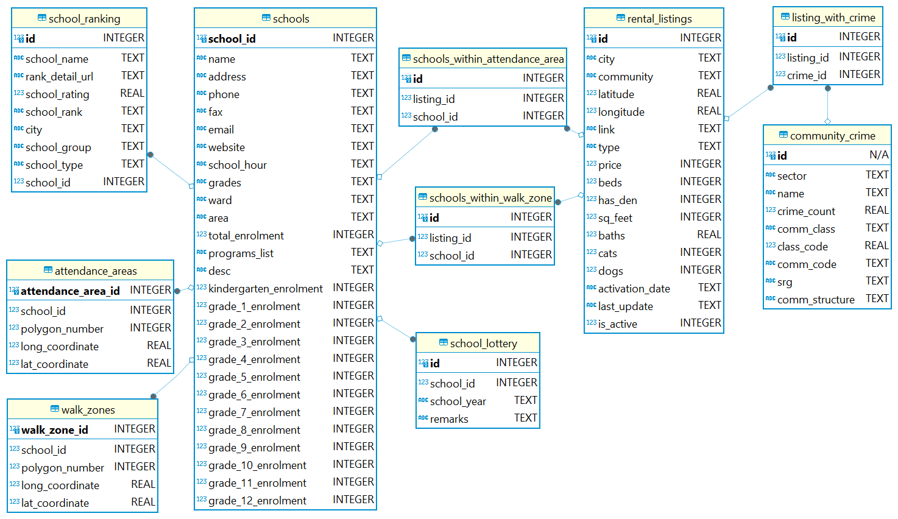

# Calgary "EduRent" Analytics

## Project Overview

This project is designed to assist families moving to Calgary, Canada, in finding optimal rental properties based on proximity to quality schools and community safety. The application integrates data from public school zones, school rankings, and real-time rental listings, enriched with crime statistics to offer a comprehensive daily report on potential housing.

## Data Sources

### School Data

- **Source:** Calgary Board of Education (CBE)
  (https://www.cbe.ab.ca/schools/school-directory/Pages/default.aspx#)
  (https://cbe.ab.ca/registration/registration/lottery/Pages/Schools-With-A-Program-In-Lottery.aspx)
- **Data Details:** Includes public schools' basic information, walk zones and attendance areas, and list of schools requiring lottery.
- **Method:** Web scraping using `httpx`, `selectolax` for HTML parsing, and `asyncio` for asynchronous requests. Refer to this folder [here](schools%20scraper) to find relevant parts of the code.

### School Ranking Data

- **Source:** Fraser Institute (https://www.compareschoolrankings.org/)
- **Data Details:** Includes rankings and rating of schools.
- **Method:** Web scraping of Javascript-based website using `playwright`. Refer to this folder [here](scrape_school_ranking_w_playwright) to find relevant parts of the code.

### Rental Listings

- **Source:** RentFaster.ca (https://www.rentfaster.ca/)
- **Data Details:** Daily rental listings in Calgary.
- **Method:** API calls with data fetched in `JSON` format

### Crime Data

- **Source:** Open data from The City of Calgary
  (https://data.calgary.ca/Health-and-Safety/Community-Crime-Statistics/78gh-n26t/about_data)
  (https://data.calgary.ca/Base-Maps/Community-Boundaries/ab7m-fwn6)
- **Data Details:** Local crime statistics by community and geospatial community boundaries.
- **Method:** Directly obtained from Open Calgary as `CSV` files, then clean and transform. Refer to this folder [here](crime_rate) to find relevant parts of the code.

## Daily Routine

The file [`routine.py`](routine.py) is executed daily to perform data ingestion. This script automates the fetching of new rental listings, integrating them with school and crime information, and processing these data points through my pipelines to update the database accordingly.

## Database Entity Relationship Diagram (ERD)

## System Logic Flowchart

For a visual representation of the data flow and processing logic in this project, please refer to the system logic flowchart below:

## Exploratory Data Analysis (EDA)

For detailed insights and analytical findings from the data collected over time, please refer to my Jupyter Notebook:

- [Exploratory Data Analysis Jupyter Notebook](exploratory%20data%20analysis_21.4.2024.ipynb)

This notebook contains various analyses performed on the dataset to uncover trends, anomalies, and valuable insights that help in understanding the dynamics of the rental market in relation to school zones and safety.

## Daily Reports

For daily updated reports generated by querying my database, which include analysis on potential rental properties that meet the defined criteria of proximity to good schools and low crime rates, check out:

- [Daily Report Notebook](results/report.ipynb)

And I will share this output to my client (i.e. my wife) for consideration:

- [Daily Report Output](results/map.html)

I mainly used it for making informed decisions about where to rent based on up-to-date data.

## Interactive Tool

I have developed an interactive tool that enables users to explore attendance areas, walk zones, and historical crime statistics based on their target locations. This tool is designed to provide valuable insights into how these factors interconnect. You can access the tool at the following link:

- [Interactive Tool](tools/schools_catchment.html)

## Contribution

Your contributions are welcome! If you wish to improve the scripts or suggest new data points, please feel free to fork this repository and submit your pull requests or open an issue to discuss your ideas.

Thank you for visiting this repository, and I hope you find the tools and data useful for your relocation or research purposes.
